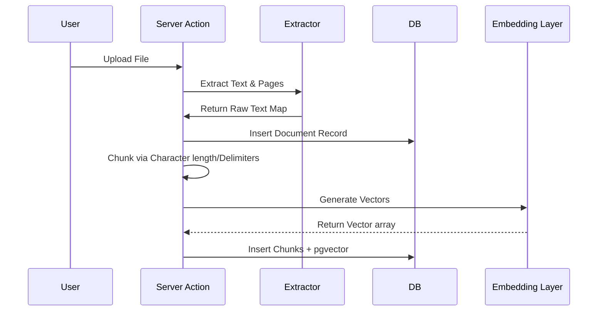

# System Architecture

This document describes the architectural layout, data structures, and foundational paradigms implemented in the Legal Contract Analyzer. 

## High-Level Tech Stack

*   **Framework:** Next.js 16 (App Router paradigm)
*   **Language:** TypeScript
*   **Database:** PostgreSQL (hosted via Supabase)
*   **ORM:** Drizzle ORM
*   **Vector Engine:** `pgvector` (cosine similarity)
*   **AI Engine:** Google Gemini (`gemini-flash-lite-latest`)
*   **Styling:** Tailwind CSS

## Core Paradigms

1.  **Deterministic Bounding:** The application aggressively prevents AI hallucination. Diffs, string length offsets, and citations are evaluated using strict mathematical arrays prior to UI render. AI is strictly relegated to *interpretation* of deterministic bounds, rather than generating the boundaries themselves. 
2.  **Stateless Streaming:** Heavy RAG interactions utilize readable server-sent event (SSE/NDJSON) streams. Connections are resilient with built-in exponential backoff fallback logic.
3.  **Server-side Heavy:** Indexing, embedding generation, semantic retrieval, and citation substring matching occur entirely on backend Route Handlers to ensure API secrets and intellectual logic remain untampered by the client.

## Database Schema (Drizzle)

The PostgreSQL database leverages relational structures tied to vector embeddings:

*   `documents`: Stores high-level file metadata and indexing status.
*   `document_chunks`: Stores exact paragraph slices, page numbers, character ranges (`characterStart`, `characterEnd`), and the actual 768-dimension `embedding` vector.
*   `conversations` / `messages`: Relational mapping saving historical chat continuity.
*   `conversation_documents`: Junction table isolating RAG scoping.
*   `citations`: Relational ties pointing parsed Agentic quotes directly back to the physical `document_chunks` for UI navigation.

## Pipeline Topologies

### 1. Ingestion Pipeline

### 2. Verification Pipeline
To prevent the notorious issue of LLMs hallucinating line numbers, we apply a **Zero-Trust Retrieval Filter**:
1. Gemini outputs `<quote>text</quote>`.
2. The server intercepts the stream, extracting candidates.
3. A strict substring evaluation algorithm tests the requested quote against the `document_chunks` text.
4. If it fails due to Gemini hallucinating or shortening words, the citation is marked `verified: false`.
5. If it passes, the exact character offset bounds inside the `document_chunk` are mathematically derived, ensuring the Client UI highlights undeniably accurate text.

### 3. Comparison Engine Pipeline
The Document Comparison engine strictly eschews traditional single-prompt "Compare these documents" mechanics (which fail heavily on large texts). Instead:
1. Both documents are recursively chunked and mapped into contiguous blocks.
2. An algorithmic alignment function groups similar blocks via distance heuristics.
3. Missing or altered blocks are strictly classified into `ADDED`, `REMOVED`, or `MODIFIED`.
4. The isolated `MODIFIED` blocks are grouped and batch-sent to the Gemini reasoning engine for explicit significance classification (HIGH/MEDIUM/LOW risk impact) and plain text summarization.
5. `NumberChanges`, `DateChanges`, and `MoneyChanges` use deterministic RegEx matching *before* AI interaction.

## Frontend UI Organization

The User Interface employs a modern forensic layout:
*   `Dashboard`: Multi-select grids allowing users to spawn RAG or Comparison pipelines seamlessly.
*   `ChatWindow`: Pinned right-side console handling streaming NDJSON blocks and rendering verified semantic anchors.
*   `DocumentViewer`: Core abstraction handling native `scrollTop` math and semantic HTML visual decorators (`<ins>`, `<del>`, `<mark>`).
*   `ComparisonView`: The 4-column workspace unifying all core systems into a highly dense information dashboard.
