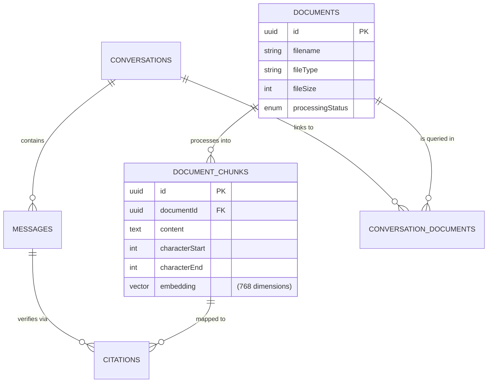
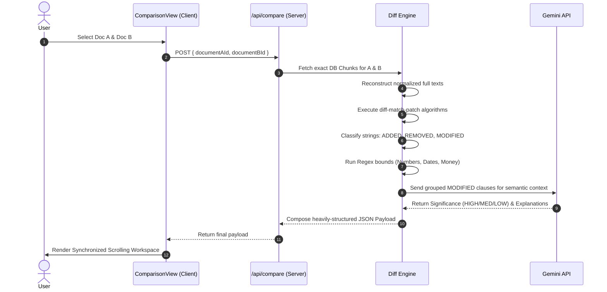

# 🏗 System Architecture

The Legal Contract Analyzer utilizes a Server-heavy extraction, vectorization, and intelligence architecture to securely handle sensitive legal documents and execute Gemini AI context bounds.

## 🗄️ Database Entity-Relationship (ER) Diagram

The PostgreSQL / Drizzle ORM layout captures one-to-many chunking and strict relational matrices for conversations.



---

## ⚙️ Component Flow: Document Comparison Engine

Instead of relying on AI to blindly "compare" two documents—which notoriously leads to hallucinated data strings—this application utilizes a layered **Structural Deterministic Diffing** algorithm before handing off to the Agentic engine.

### Sequence Analysis


---

## 🔐 Zero-Trust Citation Verification

Most RAG (Retrieval-Augmented Generation) applications blindly trust LLM-generated page numbers or coordinates. This architecture explicitly denies the AI from mapping its own UI coordinates. 

**Workflow:**
1. LLM Prompt enforces bounding quotes: `<quote>Found text</quote>`.
2. The Server intercepts the streaming NDJSON stream.
3. A Regex extractor strips the quotes.
4. A Levenshtein-distance fallback algorithm tests the Quote strictly against the exact `document_chunks` returned during original Retrieval.
5. **Only if verified**: The database offset (`characterStart` + `characterEnd`) is appended to the payload.
6. The Client `DocumentViewer.tsx` ignores all logic other than mathematically mapping the raw character offset down the DOM tree.

---

## 📂 Physical Directory Map

```text
src/
├── app/
│   ├── api/                # Core Serverless Boundaries
│   │   ├── compare/        # Deep Document Diff Engine
│   │   ├── chat/           # RAG SSE Stream handling
│   │   ├── research/       # Isolated Comparison-Chat Engine
│   │   └── documents/      # Ingestion & Extraction endpoints
│   └── page.tsx            # unified Application Dashboard
├── components/
│   ├── ChatWindow.tsx      # RAG/Agentic UI
│   ├── ComparisonView.tsx  # 4-Column Forensic Workspace
│   └── DocumentViewer.tsx  # Offset-driven Highlighting container
├── db/
│   └── schema.ts           # Drizzle Postgres layout (pgvector)
└── lib/
    ├── ai/                 # Gemini Client & Verification Math
    ├── comparison/         # Diff-Match-Patch heuristics
    └── document/           # Text Extraction (PDF.js / Mammoth)
```
