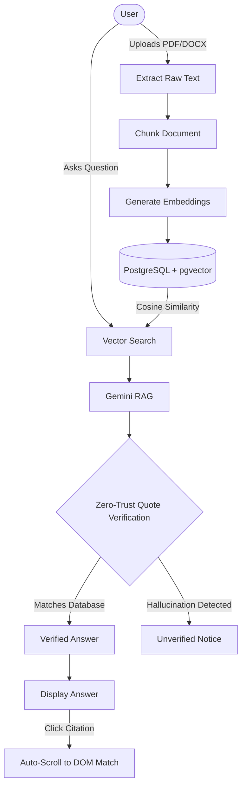
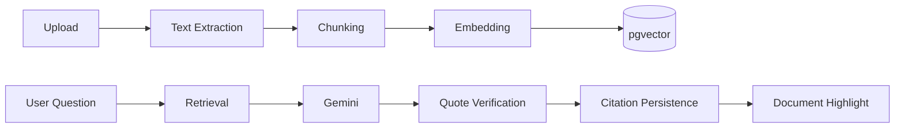
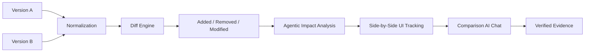
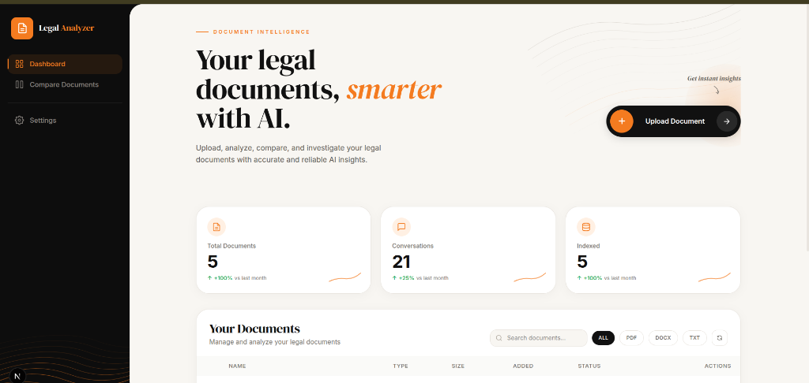
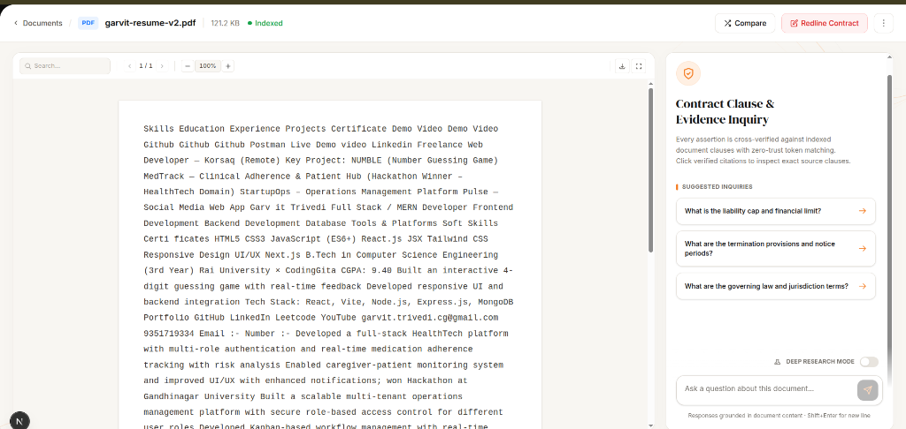
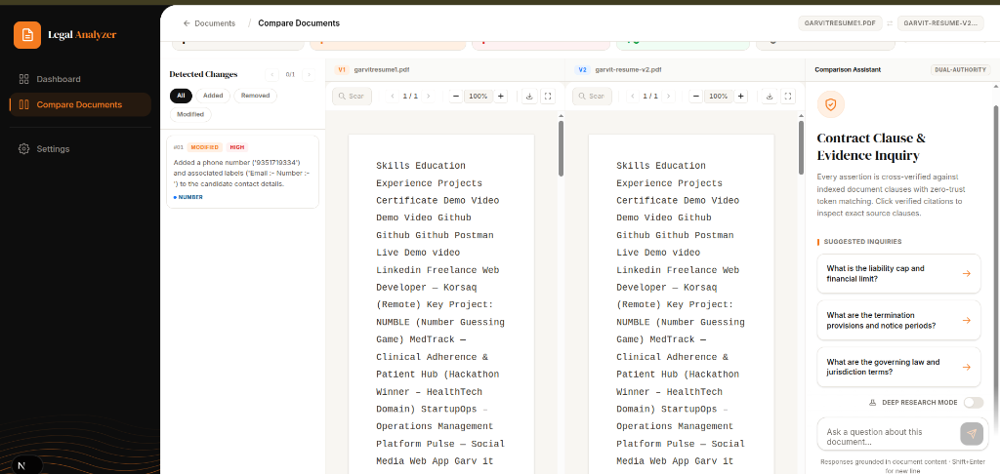
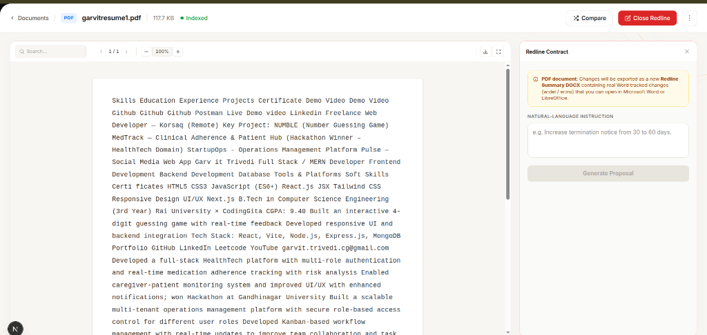
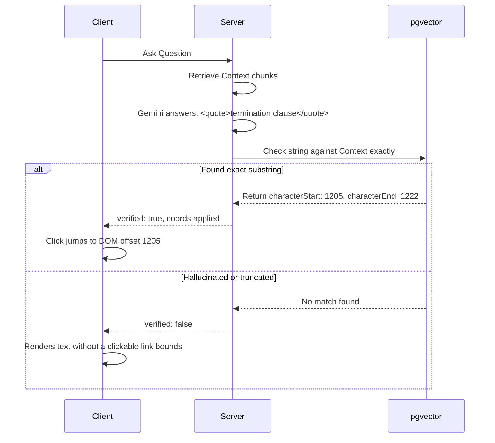

# ContractAI
## Grounded Legal Contract Intelligence

An AI-powered legal-document analysis application providing zero-hallucination semantic RAG, exact citation verification, and deep deterministic side-by-side contract comparison. 


**[View Deployed Application](https://legal-contract-analyzer-one.vercel.app/)**

---

## 📚 Documentation
All detailed documentation for this project is located in the `/docs` folder:
- **`evaluator_notes.md`**: Evaluation context covering quotation architecture, large file limits, Part C Redlining logic, and future goals.
- **`ARCHITECTURE.md`**: High-level system design, sequence diagrams, and architecture flows.
- **`CODEBASE_MAP.md`**: Breakdown of key directories and codebase structure.
- **`PROJECT_GUIDE.md`**: Deep dive into project milestones and implementation paths.
- **`LIMITATIONS.md`**: Known bounds and technical constraints of the current iteration.

---

## 1. Product Overview

ContractAI is an intelligent document processing engine tailored specifically for legal and compliance professionals who require absolute certainty in AI-generated analysis. 

While generic LLMs excel at processing text, they fail catastrophically in legal contexts by fabricating ("hallucinating") non-existent clauses, incorrect page numbers, or phantom dates. Furthermore, when analyzing discrepancies between a V1 and V2 draft of a massive contract, normal context-window constraints cause LLMs to lose track of granular structural shifts.

ContractAI solves this by strictly separating **deterministic retrieval** from **agentic reasoning**.

The application chunks documents into a vector database, uses Gemini to reason over the retrieved semantic context, and then aggressively intercepts the AI's output on the server—mathematically testing the AI's generated quotes against the raw PostgreSQL database to produce **undeniably verified citations** mapped to exact character constraints.



---

## 2. Why This Project Exists

Legal professionals cannot trust AI unless they can instantly verify its source. General-purpose document chat applications suffer from critical flaws that this project explicitly addresses.

| Standard AI Problem | ContractAI Approach |
|---|---|
| **Hallucinated Quotes** | Deterministic substring verification. Server intercepts AI quotes and mathematically evaluates them against the database strings. |
| **Fake Page Numbers** | Page mapping bound to physical extraction chunks, strictly forbidding Gemini from guessing coordinates. |
| **Large Document Cramming** | Paragraph-by-paragraph chunking and `pgvector` similarity retrieval. Only relevant chunks enter the LLM context limits. |
| **Contract Revisions** | Algorithmic diff-match-patch engine executed *before* AI interaction to group structural discrepancies explicitly. |
| **Hard-to-find Evidence** | Citation navigation. Every approved quote becomes a hyperlink that strictly scrolls the `DocumentViewer` bounds. |

---

## 3. Product Workflow 

### A. Document Semantic Ingestion & RAG


### B. Workspace Comparison (Option 2: Agentic Research)


---

## 4. Feature Overview

| Feature | Status | What it does | location |
|---|---|---|---|
| PDF / DOCX / TXT Upload | ✅ Implemented | Extracts text gracefully using `pdfjs-dist` and `mammoth`. | `lib/document/actions.ts` |
| Chunking | ✅ Implemented | Slices extraction sequentially. | `lib/document/actions.ts` |
| pgvector Embeddings | ✅ Implemented | Encodes via `gemini-flash-lite-latest` to 768 dimensions. | `lib/ai/gemini.ts` |
| RAG Chat Streaming | ✅ Implemented | Emits NDJSON Server-Sent Events natively to React. | `app/api/chat/route.ts` |
| Zero-Trust Quote Verification | ✅ Implemented | Traps AI quotes, executes Levenshtein / Strict subset filters. | `lib/ai/verification.ts` |
| Document Highlighting | ✅ Implemented | Mathematical mappings to DOM `characterStarts`. | `components/DocumentViewer.tsx` |
| Multi-Document Chat | ✅ Implemented | Global dashboard isolating chunk limits globally or individually. | `app/api/chat/route.ts` |
| Side-by-Side Comparison UI | ✅ Implemented | Mathematical proportional synchronized scrolling workspace. | `components/ComparisonView.tsx` |
| Tracked Change Accessibility | ✅ Implemented | Non-color physical markers (`<ins>`, `<del>`). | `components/ComparisonView.tsx` |
| Comparison Chat | ✅ Implemented | Physically limits AI reasoning matrix strictly to Version A & B. | `app/api/research/route.ts` |
| Tracked-change Redlining (.docx) | 🚧 Not Implemented | The repository elected for Option 2 (Agentic Research). | N/A |

---

## 5. Visual Product Tour

> **Note:** Screenshots are documented below but must be manually captured via user system.

### Dashboard / Document Library

- **Centralized Document Hub**: Manage all uploaded DOCX, PDF, and TXT files in one table.
- **Upload Progress Metrics**: Instantly tracking vector embeddings and file ingestion states.
- **Multi-Document Selection**: Select multiple checked documents via the top-level header to spawn global RAG analysis workspaces.

### Document Workspace

- **Unified Reading View**: Presents the full extracted textual representation of the parsed document safely.
- **Streaming Chat Integration**: AI interactions occur in real-time, contextually pinned to the current active document natively rendering side-by-side.
- **Verified Citations Integration**: Answers arrive fully hyperlinked to exact geographical coordinates found elsewhere in the DOM.

### Verified Citation Navigation
*(Feature functionally embedded within the Document Workspace RAG Panel)*
- **Mathematical Bound Location**: Clicking a green "Verified Source" citation fires an event to the `DocumentViewer` ref, snapping the viewport directly over the isolated character segments via mathematical string alignment (zero guessing / hallucination control).

### Document Comparison Workspace

- **Synchronized Visual Tracking**: Scroll states interpolate mathematically across pane bounds regardless of asymmetric paragraph injection length between input versions.
- **Isolated Diff Mapping**: Aggressively segregates the text changes into parsed categories (`ADDED`, `REMOVED`, `MODIFIED`).
- **Bounded Agentic Impact AI**: The comparison AI operates uniquely off isolated tracked revisions, evaluating deviation severity intelligently without losing context into un-modified bounds. 

### Tracked-Change Contract Redlining

- **Natural-Language Editing**: Submit "Make liability mutual" requests directly to the document AI contextual parser.
- **Zero-Trust Verification**: Automatically verifies the origin fragment geometrically against the source bytes before constructing OpenXML proposals.
- **Native DOCX Export Pipeline**: Directly outputs a finalized MS Word OpenXML `.docx` with natively embedded Tracked Change markup for legal negotiation.

---

## 6. Zero-Trust Citation Verification

This repository fundamentally rejects "LLM Coordinate Hallucination." 

An LLM is heavily instructed to answer using `<quote>text</quote>`. The backend forcefully intercepts the stream before reaching the user. 
The Server tests the Quote geometrically against the original parsed `document_chunks`. If a match is found, the physical database `characterStart` and `characterEnd` values are attached to the SSE payload. 

**If the AI modifies the text to make it fit gramatically, the quote fails verification.** The Client UI explicitly ignores unverified coordinates, shielding the user from jumping to phantom document locations.



---

## 7. Large Document Strategy

Processing 100-page contracts requires strategic isolation.

1. **Extraction:** Parsed entirely in-memory using Node.js buffers.
2. **Chunking Matrix:** We utilize paragraph and sentence boundaries, avoiding arbitrary mid-word slice limits.
3. **Embeddings:** Pushed asynchronously using batch insertion loops into Supabase `pgvector` to avoid Lambda 10-second request timeouts.
4. **Context Limitation:** Similarity matrices limit retrieval to `TopK=6` (or configurable parameter). The LLM context window never processes the entire document simultaneously, eliminating cost explosion and mid-context collapse.

---

## 8. Document Comparison (Part C Option 2)

We elected to build **Option 2 — Agentic Document Research** to support forensic diff analysis over generative `.docx` regeneration (Option 1).

**Workflow:**
1. Both inputs normalize to unstyled byte arrays.
2. An algorithmic text block alignment runs `diff-match-patch`. 
3. Detected shifts are aggressively sorted: `ADDED`, `REMOVED`, `MODIFIED`.
4. RegEx arrays deterministically assert if numbers, dates, or monetary markers were changed independent of the AI.
5. Finally, the isolated changed text arrays are batched to Gemini to ask, *"Explain the significance and impact of this specific revision."* 
6. Gemini flags outputs as HIGH, MED, or LOW significance.

### Synchronized Scrolling Interception
The UI mathematically scales mismatched document lengths. If Version A is 5 paragraphs and Version B is 200 paragraphs (an asymmetrical injection), 1:1 scroll events break. We mathematically determine the closest DOM mapping of an actual `diff` hook, and proportionally translate the scroll distance from Pane A down to Pane B using a locked `requestAnimationFrame` interpolation.

---

## 9. Technology Stack

| Technology | Role | Why it was chosen |
|---|---|---|
| **Next.js (16.3)** | Global Fullstack Framework | Solves Server Route/Action API generation and Client streaming natively. |
| **TypeScript** | Type Safety | Guarantees stringent JSON shapes mapping from Gemini Schema outputs. |
| **PostgreSQL + Supabase** | Relational Database | Native vector indexing via SaaS simplifies deployment heavily. |
| **pgvector** | Vector Engine | Eliminates the need for a separate expensive vector DB (like Pinecone). |
| **Drizzle ORM** | SQL Mapper | Strict Type-checked SQL statements prevent traditional injection flaws. |
| **Google Gemini Flash** | LLM Engine | Exceptional JSON formatting discipline under 1M+ token context caps. |

---

## 10. Security & Data Flow

*   `DATABASE_URL` and `GEMINI_API_KEY` are physically inaccessible to the browser.
*   Data never passes through third-party middlewares; text traverses only the First-Party Server and isolated Postgres clusters.
*   Tokens extracted via AI are physically un-executable via strict JSON stringifying boundaries in the NDJSON UI loop.

**What is NOT implemented:** 
This application lacks authentication (Auth0 / NextAuth) and Multi-Tenant RLS isolation. Currently, all processed documents exist globally on the deployment layer.

---

## 11. Local Development 

**Prerequisites:** Node.js v18+, a live Postgres database instance with `pgvector` unlocked, and a Google AI Studio Key.

**Installation & Execution:**
```bash
git clone ...
cd legal-contract-analyzer

npm install

# Push relational and vector schema
npx drizzle-kit push

# Start the Turbo server
npm run dev
```

### Environment Variables (.env.local)

| Variable | Required | Purpose | Exposure |
|---|---|---|---|
| `DATABASE_URL` | Yes | Supabase connection string executing drizzle/pgvector bindings. | SERVER ONLY |
| `GEMINI_API_KEY` | Yes | Token authenticating requests to Google AI infrastructure. | SERVER ONLY |
| `GEMINI_MODEL` | Yes | Default defined as `gemini-flash-lite-latest` in codebase constants. | SERVER ONLY |

---

## 12. 5-Minute Evaluation Path

1. **Launch App:** Navigate to dashboard.
2. **Upload Document:** Drop a generic multi-page `.docx` into the zone. Monitor the live ingestion feedback arrays.
3. **Chat Session:** Open the document. Ask specifically, *"What is the penalty for breach?"*
4. **Citation Snapping:** Note the resulting quote. Click the generated citation pill. Watch the document viewport snap precisely to the DOM mapping. 
5. **Comparison Generation:** Upload `V2` of your document. Return to the dashboard and trigger a Comparison via the Sidebar.
6. **Side-by-Side Review:** Observe the Diff loaders. Test the synchronous scroll behavior down the pane mappings. Ask the Comparison Chat specifically, *"Explain only the deviations regarding monetary penalty clauses between these two files."*

---

> *This README accurately describes the audited implementation genuinely present in the repository as configured for final evaluation. Features designated as limitations or absent are explicitly documented as intentionally excluded boundaries.*
