# Legal Contract Analyzer

An AI-powered legal-document analysis application designed to provide forensic, evaluator-ready insights into legal contracts. This tool allows users to upload documents, perform semantic search, ask grounded questions, and conduct deep agentic comparisons between contract versions with strict citation verification.


## What The Application Does

The Legal Contract Analyzer provides a complete, end-to-end journey from raw document ingestion to multi-document agentic research. 

Every interaction strictly prioritizes zero-hallucination policies, bounding all AI feedback strictly to source texts and verifiable character offsets. 

```mermaid
flowchart LR
    A[Upload PDF/DOCX/TXT]
    B[Extract Text & Metadata]
    C[Chunk by Paragraph]
    D[Generate Embeddings]
    E[(Postgres + pgvector)]
    F[Semantic Retrieval]
    G[Gemini Flash]
    H[Verified RAG Answer]
    I[Exact Citations]
    J[Document UI Highlighting]

    A --> B
    B --> C
    C --> D
    D --> E
    E --> F
    F --> G
    G --> H
    H --> I
    I --> J
```



### Core Features

1. **Document Ingestion Layer:** Safely uploads, extracts, chunks, and semantically embeds PDF, DOCX, and TXT files directly to PostgreSQL.
2. **Semantic RAG Chat:** Ask questions regarding single or multiple documents via a highly-tuned Retrieval-Augmented Generation pipeline.
3. **Strict Citation Verification:** AI-generated quotes are intercepted securely on the server, tested via strict substring matching, and converted into exact offset boundaries for highlight-navigation.
4. **Document Comparison Workspace:** A 4-column forensic workspace comparing two versions of a contract side-by-side.
5. **Deterministic Alignment:** Text changes are aligned structurally (Added, Removed, Modified), preventing AI hallucination of diffs.
6. **Agentic Research Chat:** An isolated chat stream scoping analysis strictly to two compared versions, extracting high-impact discrepancies (like monetary or probationary alterations).
7. **Synchronized Scrolling:** Employs normalized proportional scrolling that effortlessly interlocks distinct document versions based on structural anchors.

## How It Works

1. **Data Layer:** Documents are processed with standard extraction libraries (PDF.js/Mammoth) and pushed chunk-by-chunk to Supabase via Drizzle ORM.
2. **Retrieval Layer:** The `pgvector` extension facilitates native cosine-similarity vector searches against Gemini-generated text embeddings.
3. **Intelligence Layer:** Google's Gemini acts as the reasoning engine for chat, executing instructions with strict grounding parameters.
4. **Presentation Layer:** Next.js Server Components and advanced Client Components render smooth, dynamic forensic workspaces. Text highlights utilize strict DOM `characterStart` tracking instead of unreliable AI-generated page numbers.

## Getting Started

### Prerequisites

- Node.js (v18+)
- PostgreSQL Database with `pgvector` enabled (e.g., Supabase)
- Google Gemini API Key

### Local Setup

1. **Clone and Install:**
```bash
npm install
```

2. **Configure Environment:**
Create a `.env.local` based on `.env.example`:
```env
DATABASE_URL="postgres://your-postgres-url"
GEMINI_API_KEY="your-gemini-key"
GEMINI_MODEL="gemini-flash-lite-latest"
```

3. **Database Migration:**
```bash
npm run db:push
```

4. **Run the Development Server:**
```bash
npm run dev
```

Visit `http://localhost:3000` to interact with the dashboard.

## What To Test

Evaluators operating this repository should specifically verify:

- **Ingestion:** Upload a multi-page PDF and verify real-time processing feedback.
- **RAG Integrity:** Ask a specific question and click the generated citation to ensure it instantly scrolls and highlights the raw chunk.
- **Side-by-Side Comparison:** Upload two slightly varied version of a DOCX. Observe the Agentic engine flag monetary, numerical, or date alterations explicitly in the sidebar. Validate synchronized scrolling and strictly non-color indicator accessibility adjustments (underline/strikethrough).
