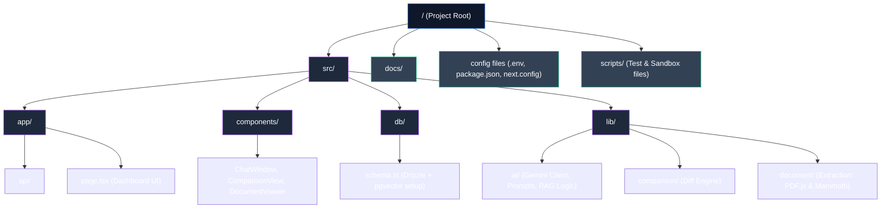
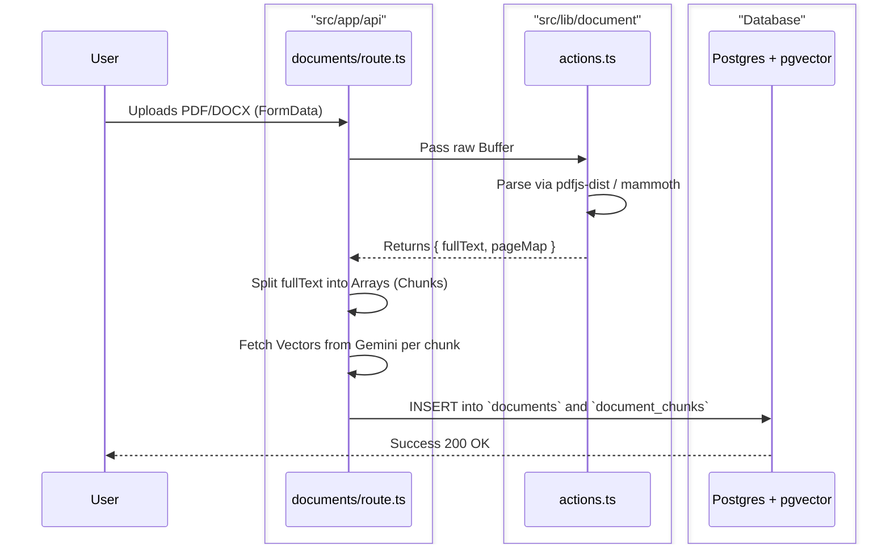
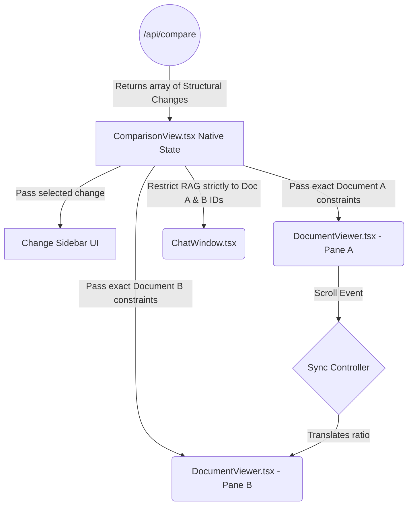

# 🗺 Codebase Map & Data Flow

This document provides a highly visual blueprint of the entire repository. It explains how folders are structured, what specific files are responsible for, and how data physically travels between these components during runtime.

---

## 📂 The Directory Structure

We keep root-level clutter to a minimum. All core logic operates securely inside `src/`.

---

## 🧩 Component & Folder Responsibility

| Physical Path | Primary Responsibility | Key Files |
|---|---|---|
| `src/app/api/documents/route.ts` | **Ingestion Edge:** Receives file uploads, extracts binary data, executes Chunking, and commands Insertions to DB. | Handles `FormData`. |
| `src/app/api/chat/route.ts` | **RAG Streamer:** Receives user queries, executes `pgvector` search, prompts Gemini, streams SSE responses. | Emits NDJSON. |
| `src/app/api/compare/route.ts` | **Diff Orchestrator:** Triggers the Diff-Match engine and passes modified clauses to Gemini for evaluation. | Maps JSON changes. |
| `src/lib/ai/verification.ts` | **Safety Filter:** The mathematical brain that intercepts LLM quotes and checks them perfectly against DB chunks. | Uses Levenshtein. |
| `src/components/DocumentViewer.tsx`| **Renderer:** Maps exact `characterStart` numbers to DOM nodes without relying on `window.find()`. | Core visual layout. |
| `src/components/ComparisonView.tsx`| **Forensic UI:** The 4-column master view coordinating state between Panes, Stats, Sidebars, and the isolated ChatWindow. | Manages Sync Scroll. |

---

## 🌊 How Data Passes Between Them

Understanding the flow of data is critical to understanding the security and performance boundaries of ContractAI.

### Flow 1: Ingestion Pipeline (Upload ➔ Database)
Data enters as a raw file and is instantly shredded into semantic pieces.

### Flow 2: UI Comparison Coordination (State & Isolation)
When the user triggers a Comparison, the data flows downward from a Master controller precisely into isolated UI visualizers.

*   **How UI isolation works:** The `ChatWindow` component is passed an array of `documentIds = [DocA, DocB]`. When a chat message is sent to `/api/chat`, the Server explicitly restricts the `<quote>` verification and semantic retrieval **only** within those DB `ids`, securely separating the user's workspace from unrelated documents elsewhere in the database.

---

## 🧭 Documentation Map Summary

You now have a clean root repository! To explore the product's design further, rely on these 4 pillars located in the `docs/` folder:

1. [**README.md**](../README.md): High-level elevator pitch, tech stack, and rapid spin-up commands.
2. [**docs/ARCHITECTURE.md**](ARCHITECTURE.md): Database ER schemas, rigorous strict parsing logic, and verification theories.
3. [**docs/LIMITATIONS.md**](LIMITATIONS.md): Transparent disclosure of API rate-limits, UX scrolling edges, and file-parsing bounds.
4. [**docs/PROJECT_GUIDE.md**](PROJECT_GUIDE.md): The precise step-by-step click-path for evaluating the product correctly.
